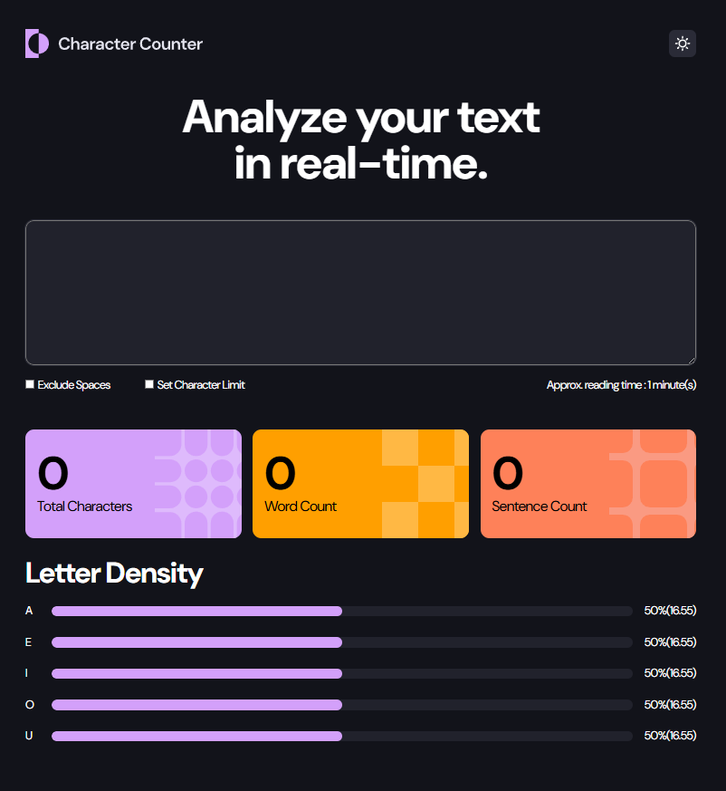

# Frontend Mentor - Character counter solution

This is a solution to the [Character counter challenge on Frontend Mentor](https://www.frontendmentor.io/challenges/character-counter-znSgeWs_i6). Frontend Mentor challenges help you improve your coding skills by building realistic projects.

## Table of contents

- [Overview](#overview)
  - [The challenge](#the-challenge)
  - [Screenshot](#screenshot)
  - [Links](#links)
- [My process](#my-process)
  - [Built with](#built-with)
  - [What I learned](#what-i-learned)
  - [Continued development](#continued-development)
- [Author](#author)
- [Acknowledgments](#acknowledgments)

**Note: Delete this note and update the table of contents based on what sections you keep.**

## Overview

### The challenge

Users should be able to:

- Analyze the character, word, and sentence counts for their text
- Exclude/Include spaces in their character count
- Set a character limit
- Receive a warning message if their text exceeds their character limit
- See the approximate reading time of their text
- Analyze the letter density of their text
- Select their color theme
- View the optimal layout for the interface depending on their device's screen size
- See hover and focus states for all interactive elements on the page

### Screenshot



### Links

- Solution URL: [Add solution URL here](https://your-solution-url.com)
- Live Site URL: [Add live site URL here](https://your-live-site-url.com)

## My process

### Built with

- Semantic HTML5 markup
- CSS custom properties
- Flexbox

### What I learned

Here's a list of things I learned while creating and streaming the creation of this project. I had some good help from those who watched me code this!

To see how you can add code snippets, see below:

1. It was suggested that, going forward, it's better to apply dark/light theme options to the body element instead of individual elements. This was my first time adding a class to the body element. Small change, but I'm sure it will have big results.

```html
<body class="placeholder"></body>
```

2. Sometimes it's the small things that make big changes. Thanks to someone watching the stream, I realized I need to revisit my understanding of `min-width` and `max-width`. I was attempting to solve an easy issue in a complicated way when all it required were these two lines.

```css
.widths-and-minWidth {
  width: 990px;
  min-width: 375px;
}
```

3. The implementation of the `array.includes()` method along with a viewer suggestion taught me new ways of working with arrays!

```js
arr.forEach((element) => {
  if (this.vowelsList.includes(element)) {
    this.vowelsCount[element]++;
  }
});
// console.log("done");
```

4. The use of destructuring! This was a new concept I learned this week! Comes in really handy. This is an example of ...spread.

```js
let currentUserInput = [...userInput.value];
```

### Continued development

1. Advanced CSS Concepts and techniques
2. Organization of JS Code
3. Planning
4. Patience

## Author

- Youtube - [@christencodes](https://www.youtube.com/@christencodes)
- Github - [christencodes](https://github.com/christencodes)
- Frontend Mentor - [@christencodes](https://www.frontendmentor.io/profile/christencodes)
- Twitter - [@christencodes](https://www.twitter.com/christencodes)
- TikTok - [@christencoes\_](https://www.tiktok.com/@christencodes_)

## Acknowledgments

Thank you to everyone who helped me on stream! Thanks to all the people in discord who posted code snippets and gave advice! Thanks!
